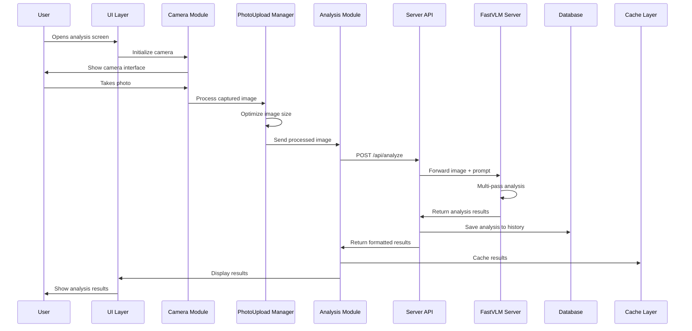
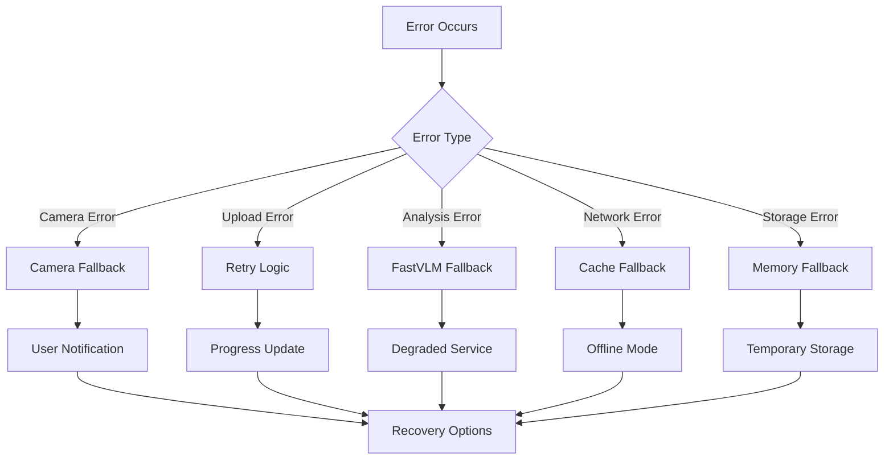

# Design Document - Analysis Module Audit & Refactoring

## Overview

Данный документ описывает техническую архитектуру и методологию комплексного аудита модуля analysis в TgStyle приложении. Аудит будет проводиться по принципу "от входа до выхода", следуя полному call stack выполнения анализа.

## Architecture

### Current Analysis Module Architecture

```mermaid
graph TB
    subgraph "Client Layer"
        UI[UI Components]
        Camera[Camera Module]
        PhotoUpload[Photo Upload Manager]
        Analysis[Analysis Module]
        Carousel[History Carousel]
        Cache[Data Cache]
    end
    
    subgraph "Server Layer"
        API[Express API]
        AnalyzeEndpoint[/api/analyze]
        HistoryEndpoint[/api/history]
        SharedEndpoint[/api/shared-analysis]
    end
    
    subgraph "AI Layer"
        FastVLM[FastVLM Server]
        Gemini[Gemini API]
        Ollama[Ollama API]
    end
    
    subgraph "Storage Layer"
        DB[(PostgreSQL)]
        LocalStorage[localStorage]
        Memory[Memory Cache]
    end
    
    UI --> Camera
    Camera --> PhotoUpload
    PhotoUpload --> Analysis
    Analysis --> API
    API --> AnalyzeEndpoint
    AnalyzeEndpoint --> FastVLM
    FastVLM --> Gemini
    FastVLM --> Ollama
    
    AnalyzeEndpoint --> DB
    API --> HistoryEndpoint
    HistoryEndpoint --> DB
    
    Analysis --> Cache
    Cache --> LocalStorage
    Cache --> Memory
    
    Carousel --> HistoryEndpoint
    Carousel --> Cache
```

### Analysis Flow Call Stack



## Components and Interfaces

### 1. Client-Side Components

#### Camera Module (`client/src/modules/camera.ts`)
**Responsibilities:**
- Camera initialization and configuration
- Photo capture and preview
- Device compatibility handling
- Error handling for camera access

**Key Methods to Audit:**
- `initializeCamera()`
- `capturePhoto()`
- `handleCameraError()`
- `checkDeviceCompatibility()`

#### Photo Upload Manager (`client/src/modules/photoUploadManager.ts`)
**Responsibilities:**
- Image preprocessing and optimization
- File size management
- Format conversion
- Upload progress tracking

**Key Methods to Audit:**
- `processImage()`
- `optimizeImageSize()`
- `convertFormat()`
- `uploadWithProgress()`

#### Analysis Module (`client/src/modules/analysis.ts`)
**Responsibilities:**
- Orchestrating analysis flow
- API communication
- Result processing
- Error handling

**Key Methods to Audit:**
- `startAnalysis()`
- `processResults()`
- `handleAnalysisError()`
- `cacheResults()`

#### UI Analysis (`client/src/modules/uiAnalysis.ts`)
**Responsibilities:**
- Results display and formatting
- User interaction handling
- Animation and transitions
- Responsive design

**Key Methods to Audit:**
- `displayResults()`
- `formatAnalysisData()`
- `handleUserInteraction()`
- `updateUI()`

#### History Carousel (`client/src/modules/carousel/`)
**Responsibilities:**
- History display and navigation
- Pagination and lazy loading
- Cache integration
- Performance optimization

**Key Methods to Audit:**
- `loadHistory()`
- `renderCarousel()`
- `handleNavigation()`
- `optimizePerformance()`

### 2. Server-Side Components

#### Analysis API (`server/src/api/analyze.js`)
**Responsibilities:**
- Request validation and processing
- FastVLM integration
- Response formatting
- Error handling

**Key Methods to Audit:**
- `analyzeImage()`
- `validateRequest()`
- `processResponse()`
- `handleErrors()`

#### History API (`server/src/api/history.js`)
**Responsibilities:**
- History CRUD operations
- Database queries optimization
- Pagination logic
- Data filtering

**Key Methods to Audit:**
- `getHistory()`
- `saveAnalysis()`
- `deleteHistory()`
- `optimizeQueries()`

#### Shared Analysis API (`server/src/api/sharedAnalysis.js`)
**Responsibilities:**
- Public sharing functionality
- Privacy and security
- Metadata management
- Access control

**Key Methods to Audit:**
- `shareAnalysis()`
- `validateAccess()`
- `manageMetadata()`
- `enforcePrivacy()`

### 3. FastVLM Server (`fastvlm-server/server.py`)

**Architecture Components:**
- Flask application server
- Model loading and management
- GPU/CPU optimization
- Multi-pass analysis pipeline
- Gemini/Ollama integration

**Key Functions to Audit:**
- `analyze()` - Main analysis endpoint
- `perform_multi_pass_analysis()` - Multi-pass processing
- `load_model()` - Model initialization
- `create_stylist_response()` - AI response generation
- `gpu_memory_manager()` - Resource management

## Data Models

### Analysis Data Flow

```typescript
interface AnalysisRequest {
  image_base64: string;
  prompt?: string;
  nickname: string;
  topic: string;
}

interface AnalysisResponse {
  success: boolean;
  technical_analysis: string;
  analysis: string;
  model_used: string;
  timing: {
    total_time: number;
    fastvlm_time: number;
    stylist_time: number;
  };
  multi_pass_results: {
    person: string;
    clothing: string;
    legs: string;
    shoes: string;
    accessories_head: string;
    accessories_hand: string;
  };
}

interface HistoryItem {
  id: number;
  userId: number;
  imageUrl: string;
  analysis: string;
  technical_analysis?: string;
  isShared: boolean;
  createdAt: Date;
  metadata?: AnalysisMetadata;
}
```

### Cache Structure

```typescript
interface CacheStructure {
  memory: {
    recentAnalyses: AnalysisResponse[];
    userHistory: HistoryItem[];
    carouselData: CarouselItem[];
  };
  localStorage: {
    analysisCache: string; // JSON serialized
    historyCache: string;  // JSON serialized
    userPreferences: string;
  };
  database: {
    historyItems: HistoryItem[];
    sharedAnalyses: SharedAnalysis[];
    userMetadata: UserMetadata[];
  };
}
```

## Error Handling

### Error Categories and Handling Strategy



### Error Handling Patterns to Audit

1. **Camera Access Errors**
   - Permission denied
   - Hardware not available
   - Browser compatibility

2. **Upload Errors**
   - Network timeouts
   - File size limits
   - Format issues

3. **Analysis Errors**
   - FastVLM server down
   - Model loading failures
   - Processing timeouts

4. **Storage Errors**
   - Database connection issues
   - Cache overflow
   - localStorage limits

## Testing Strategy

### 1. Unit Testing Approach

**Components to Test:**
- Individual module methods
- Data transformation functions
- Error handling logic
- Cache operations

**Testing Framework:**
- Jest for JavaScript/TypeScript
- pytest for Python (FastVLM)

### 2. Integration Testing

**Integration Points:**
- Client ↔ Server API
- Server ↔ FastVLM
- FastVLM ↔ AI Services
- Cache ↔ Storage layers

### 3. Performance Testing

**Metrics to Measure:**
- End-to-end analysis time
- Image processing speed
- Memory usage patterns
- Cache hit rates
- Database query performance

**Load Testing Scenarios:**
- Concurrent analysis requests
- Large image processing
- History carousel with many items
- Cache invalidation under load

### 4. User Experience Testing

**UX Metrics:**
- Time to first interaction
- Analysis completion time
- Error recovery time
- Interface responsiveness

## Audit Methodology

### Phase 1: Static Code Analysis

1. **Code Quality Assessment**
   - ESLint/TSLint violations
   - Code complexity metrics
   - Dependency analysis
   - Security vulnerabilities

2. **Architecture Review**
   - SOLID principles compliance
   - Design patterns usage
   - Module coupling analysis
   - Interface consistency

### Phase 2: Dynamic Analysis

1. **Performance Profiling**
   - CPU usage patterns
   - Memory allocation tracking
   - Network request analysis
   - Rendering performance

2. **Error Scenario Testing**
   - Network failures
   - Server timeouts
   - Invalid inputs
   - Resource exhaustion

### Phase 3: End-to-End Flow Analysis

1. **Call Stack Tracing**
   - Method execution order
   - Parameter passing
   - Return value handling
   - Side effect tracking

2. **Data Flow Validation**
   - Input validation
   - Data transformation
   - Storage operations
   - Cache consistency

### Phase 4: Optimization Recommendations

1. **Performance Optimizations**
   - Bottleneck identification
   - Caching strategies
   - Resource management
   - Algorithm improvements

2. **Architecture Improvements**
   - Modularization suggestions
   - Interface redesign
   - Error handling enhancement
   - Scalability improvements

## Implementation Plan

### Audit Tools and Technologies

1. **Code Analysis Tools**
   - SonarQube for code quality
   - ESLint for JavaScript/TypeScript
   - Pylint for Python
   - Dependency-cruiser for dependency analysis

2. **Performance Monitoring**
   - Chrome DevTools for client-side profiling
   - Node.js profiler for server-side
   - Python profiler for FastVLM
   - Custom timing instrumentation

3. **Testing Frameworks**
   - Jest for unit testing
   - Cypress for E2E testing
   - Artillery for load testing
   - pytest for Python testing

### Deliverables

1. **Audit Report**
   - Executive summary
   - Detailed findings
   - Performance metrics
   - Recommendations

2. **Architecture Documentation**
   - Updated system diagrams
   - API documentation
   - Data flow diagrams
   - Error handling guides

3. **Steering Updates**
   - Best practices guide
   - Coding standards
   - Architecture patterns
   - Performance guidelines

4. **Refactoring Plan**
   - Priority-based task list
   - Implementation timeline
   - Risk assessment
   - Success metrics

## Success Criteria

### Performance Targets

- **Analysis Time**: < 5 seconds end-to-end
- **Image Upload**: < 2 seconds for typical mobile photos
- **History Loading**: < 1 second for carousel display
- **Cache Hit Rate**: > 80% for repeated operations
- **Error Rate**: < 1% for normal operations

### Quality Targets

- **Code Coverage**: > 80% for critical paths
- **Complexity Score**: < 10 for individual methods
- **Dependency Count**: Minimize external dependencies
- **Security Score**: No high/critical vulnerabilities
- **Accessibility**: WCAG 2.1 AA compliance

### User Experience Targets

- **Time to Interactive**: < 3 seconds
- **Error Recovery**: < 5 seconds average
- **Interface Responsiveness**: < 100ms for user actions
- **Mobile Performance**: Consistent across devices
- **Offline Capability**: Basic functionality without network