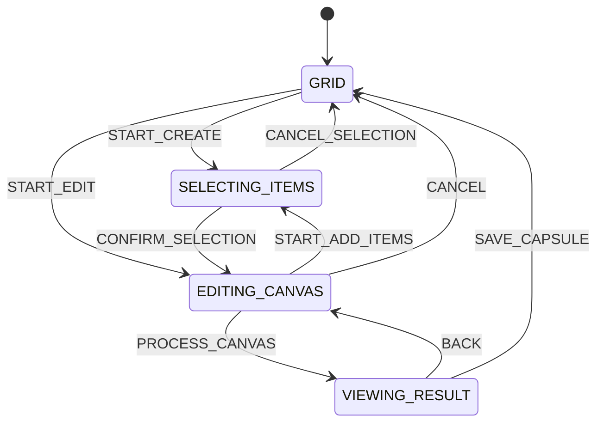
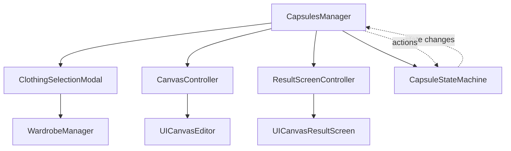
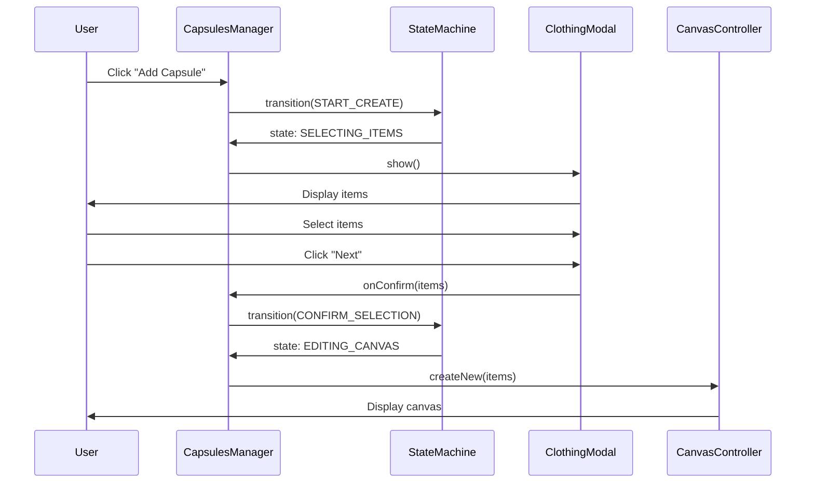

# Design Document

## Overview

This document describes the architectural design for refactoring the Capsules module. The refactoring transforms a monolithic 1250-line class into a modular architecture with clear separation of concerns, predictable state management, and improved maintainability.

## Architecture

### High-Level Structure

```
capsules/
├── CapsulesManager.ts              # Main coordinator (~300 lines)
├── ClothingSelectionModal.ts       # Modal window management (~200 lines)
├── CanvasController.ts             # Canvas operations (~250 lines)
├── ResultScreenController.ts       # Result screen management (~150 lines)
├── CapsuleStateMachine.ts          # State management (~200 lines)
├── types.ts                        # TypeScript types and interfaces
├── CapsulesService.ts              # API service (existing)
└── CapsulesSharing.ts              # Sharing functionality (existing)
```

### Module Responsibilities

#### CapsulesManager (Coordinator)
- Orchestrates interactions between modules
- Handles public API methods
- Manages module lifecycle
- Delegates operations to specialized controllers
- **Does NOT**: Directly manipulate DOM, manage event handlers, or handle state transitions

#### ClothingSelectionModal
- Opens/closes clothing selection modal
- Manages item selection state
- Integrates with WardrobeManager for grid rendering
- Handles modal event handlers (close, confirm, cancel)
- Automatically cleans up on hide
- **Does NOT**: Know about canvas or result screen

#### CanvasController
- Manages UICanvasEditor lifecycle
- Provides unified methods for canvas operations
- Handles item addition/removal without clearing canvas
- Manages canvas state persistence
- **Does NOT**: Handle navigation or modal windows

#### ResultScreenController
- Manages UICanvasResultScreen lifecycle
- Handles save/share/done actions
- Processes canvas to final image with watermark
- **Does NOT**: Handle canvas editing or item selection

#### CapsuleStateMachine
- Defines valid states and transitions
- Prevents invalid state transitions
- Stores state context (capsuleId, selectedItems, etc.)
- Emits events on state changes
- **Does NOT**: Perform actual operations, only manages state

## Components and Interfaces

### ClothingSelectionModal

```typescript
interface ClothingSelectionModalConfig {
  modalId: string;
  gridId: string;
  onItemToggle?: (item: WardrobeItem) => void;
}

interface ShowModalOptions {
  preselectedIds?: number[];
  title?: string;
  onConfirm: (selectedItems: WardrobeItem[]) => void;
  onCancel: () => void;
}

class ClothingSelectionModal {
  private selectedItems: WardrobeItem[] = [];
  private wardrobeItems: WardrobeItem[] = [];
  private eventHandlers: Map<string, EventListener> = new Map();
  private abortController: AbortController | null = null;
  
  constructor(config: ClothingSelectionModalConfig);
  
  async show(options: ShowModalOptions): Promise<void>;
  hide(): void;
  getSelectedItems(): WardrobeItem[];
  
  private setupEventHandlers(options: ShowModalOptions): void;
  private cleanupEventHandlers(): void;
  private handleItemToggle(item: WardrobeItem): void;
  private updateNextButtonState(): void;
}
```

### CanvasController

```typescript
interface CanvasControllerConfig {
  containerId: string;
  canvasId: string;
  onAddItemClick?: () => void;
  onNextClick?: () => void;
}

class CanvasController {
  private canvasEditor: UICanvasEditor | null = null;
  
  constructor(config: CanvasControllerConfig);
  
  // Create new capsule with items
  async createNew(items: WardrobeItem[]): Promise<void>;
  
  // Edit existing capsule
  async edit(capsuleId: number): Promise<void>;
  
  // Add items without clearing canvas
  async addItems(items: WardrobeItem[]): Promise<void>;
  
  // Remove specific items
  async removeItems(itemIds: number[]): Promise<void>;
  
  // Get current state
  async getState(): Promise<CanvasState>;
  
  // Get item IDs on canvas
  getItemIds(): number[];
  
  // Show/hide canvas
  show(): void;
  hide(): void;
  
  // Cleanup
  destroy(): void;
}
```

### CapsuleStateMachine

```typescript
type CapsuleState = 
  | { type: 'GRID' }
  | { type: 'SELECTING_ITEMS', context: { capsuleId?: number, mode: 'create' | 'add' } }
  | { type: 'EDITING_CANVAS', context: { capsuleId?: number, items: WardrobeItem[] } }
  | { type: 'VIEWING_RESULT', context: { capsuleId?: number, resultImage: string } };

type CapsuleAction =
  | { type: 'START_CREATE' }
  | { type: 'START_EDIT', capsuleId: number }
  | { type: 'START_ADD_ITEMS' }
  | { type: 'CONFIRM_SELECTION', items: WardrobeItem[] }
  | { type: 'CANCEL_SELECTION' }
  | { type: 'PROCESS_CANVAS', resultImage: string }
  | { type: 'SAVE_CAPSULE' }
  | { type: 'RETURN_TO_GRID' };

interface StateTransition {
  from: CapsuleState['type'];
  to: CapsuleState['type'];
  action: CapsuleAction['type'];
}

class CapsuleStateMachine {
  private currentState: CapsuleState = { type: 'GRID' };
  private validTransitions: StateTransition[];
  private listeners: ((state: CapsuleState) => void)[] = [];
  
  constructor();
  
  // Transition to new state
  transition(action: CapsuleAction): boolean;
  
  // Get current state
  getCurrentState(): CapsuleState;
  
  // Check if transition is valid
  canTransition(action: CapsuleAction): boolean;
  
  // Subscribe to state changes
  subscribe(listener: (state: CapsuleState) => void): () => void;
  
  // Get state context
  getContext<T>(): T | undefined;
}
```

### ResultScreenController

```typescript
interface ResultScreenControllerConfig {
  screenId: string;
  onSave?: (image: string) => void;
  onShare?: (image: string) => void;
  onDone?: () => void;
}

class ResultScreenController {
  private resultScreen: UICanvasResultScreen | null = null;
  private currentImage: string | null = null;
  
  constructor(config: ResultScreenControllerConfig);
  
  // Show result screen with image
  show(imageBase64: string): void;
  
  // Hide result screen
  hide(): void;
  
  // Get current image
  getCurrentImage(): string | null;
  
  // Cleanup
  destroy(): void;
  
  private handleSave(): void;
  private handleShare(): void;
  private handleDone(): void;
}
```

### Refactored CapsulesManager

```typescript
class CapsulesManager {
  // Sub-modules
  private clothingModal: ClothingSelectionModal;
  private canvasController: CanvasController;
  private resultController: ResultScreenController;
  private stateMachine: CapsuleStateMachine;
  
  // UI Components
  private capsulesGrid: UICapsulesGrid;
  
  // Data
  private capsules: StyleCapsule[] = [];
  private currentCapsuleId: number | null = null;
  
  constructor() {
    this.initializeModules();
    this.setupStateMachineListeners();
  }
  
  // Public API
  async handleCapsulesOpen(): Promise<void>;
  closeCapsules(): void;
  
  // Delegated operations
  private async handleAddCapsuleClick(): Promise<void>;
  private async handleViewCapsule(capsuleId: number): Promise<void>;
  private async handleDeleteCapsule(capsuleId: number): Promise<void>;
  private async handleGeneratedCapsule(capsule: GeneratedCapsule): Promise<void>;
  
  // State machine handlers
  private onStateChange(state: CapsuleState): void;
  
  // Module initialization
  private initializeModules(): void;
  private setupStateMachineListeners(): void;
}
```

## Data Models

### Navigation State

```typescript
interface NavigationState {
  stateType: CapsuleState['type'];
  context: any;
  timestamp: number;
}

interface NavigationStack {
  states: NavigationState[];
  currentIndex: number;
}
```

### Modal Configuration

```typescript
interface ModalState {
  isOpen: boolean;
  title: string;
  selectedItemIds: number[];
  mode: 'create' | 'edit' | 'add';
}
```

## Error Handling

### Error Types

```typescript
class CapsuleError extends Error {
  constructor(
    message: string,
    public code: string,
    public context?: any
  ) {
    super(message);
    this.name = 'CapsuleError';
  }
}

// Specific error types
class InvalidStateTransitionError extends CapsuleError {}
class CanvasNotInitializedError extends CapsuleError {}
class ModalAlreadyOpenError extends CapsuleError {}
```

### Error Handling Strategy

1. **Module-level**: Each module catches its own errors and logs them
2. **Coordinator-level**: CapsulesManager catches errors from modules and shows user-friendly messages
3. **Graceful degradation**: If a module fails, other modules continue to work
4. **User feedback**: Always show meaningful error messages to users

## Testing Strategy

### Unit Tests

Each module will have unit tests covering:

1. **ClothingSelectionModal**
   - Opening/closing modal
   - Item selection/deselection
   - Event handler cleanup
   - Integration with WardrobeManager

2. **CanvasController**
   - Creating new canvas
   - Editing existing canvas
   - Adding items without clearing
   - Removing items

3. **CapsuleStateMachine**
   - Valid state transitions
   - Invalid transition prevention
   - Context management
   - Event emission

4. **ResultScreenController**
   - Showing/hiding result screen
   - Save/share/done actions
   - Image processing

### Integration Tests

1. **Full workflow**: Create capsule → Edit → Save
2. **Add items workflow**: Create capsule → Add items → Save
3. **Generated capsule workflow**: Generate → Edit → Save
4. **Navigation**: Back button behavior in all states

### Manual Testing Checklist

- [ ] Create new capsule with 3 items
- [ ] Edit existing capsule
- [ ] Add items to existing capsule (verify positions preserved)
- [ ] Remove items from capsule
- [ ] Generate AI capsule
- [ ] Save capsule
- [ ] Share capsule
- [ ] Delete capsule
- [ ] Back button navigation in all states
- [ ] Modal close button
- [ ] Modal overlay click
- [ ] Error scenarios (network failure, invalid data)

## Migration Strategy

### Phase 1: Create New Modules (No Breaking Changes)
1. Create ClothingSelectionModal.ts
2. Create CanvasController.ts
3. Create ResultScreenController.ts
4. Create CapsuleStateMachine.ts
5. Create types.ts

### Phase 2: Integrate New Modules (Parallel Implementation)
1. Update CapsulesManager to use new modules
2. Keep old code commented out for rollback
3. Test each integration point

### Phase 3: Remove Old Code
1. Remove old modal logic
2. Remove old canvas logic
3. Remove old state management
4. Clean up unused methods

### Phase 4: Optimization
1. Remove duplicate code
2. Optimize event handlers
3. Add performance logging
4. Update documentation

## Performance Considerations

### Event Handler Optimization
- Use AbortController for automatic cleanup
- Debounce frequent events (item selection)
- Use event delegation where possible

### Canvas Performance
- Lazy load canvas editor (only when needed)
- Reuse canvas instance when possible
- Optimize image loading with caching

### State Machine Performance
- Use Map for O(1) transition lookup
- Cache valid transitions
- Minimize state change notifications

## Diagrams

### State Machine Flow



### Module Interaction



### Data Flow: Create Capsule



## Security Considerations

1. **Input Validation**: Validate all user inputs (item IDs, capsule IDs)
2. **XSS Prevention**: Sanitize any user-generated content
3. **State Validation**: Ensure state transitions are valid before executing
4. **Error Messages**: Don't expose sensitive information in error messages

## Accessibility Considerations

1. **Keyboard Navigation**: Ensure all modals and buttons are keyboard accessible
2. **Screen Readers**: Add ARIA labels to all interactive elements
3. **Focus Management**: Properly manage focus when opening/closing modals
4. **Error Announcements**: Announce errors to screen readers

## Documentation Updates

After refactoring, update:
1. README.md with new architecture
2. API documentation for each module
3. Migration guide for developers
4. Troubleshooting guide
5. Architecture diagrams in .kiro/steering/
