# Диаграммы потоков данных - TgStyle

## Добавление вещи в гардероб

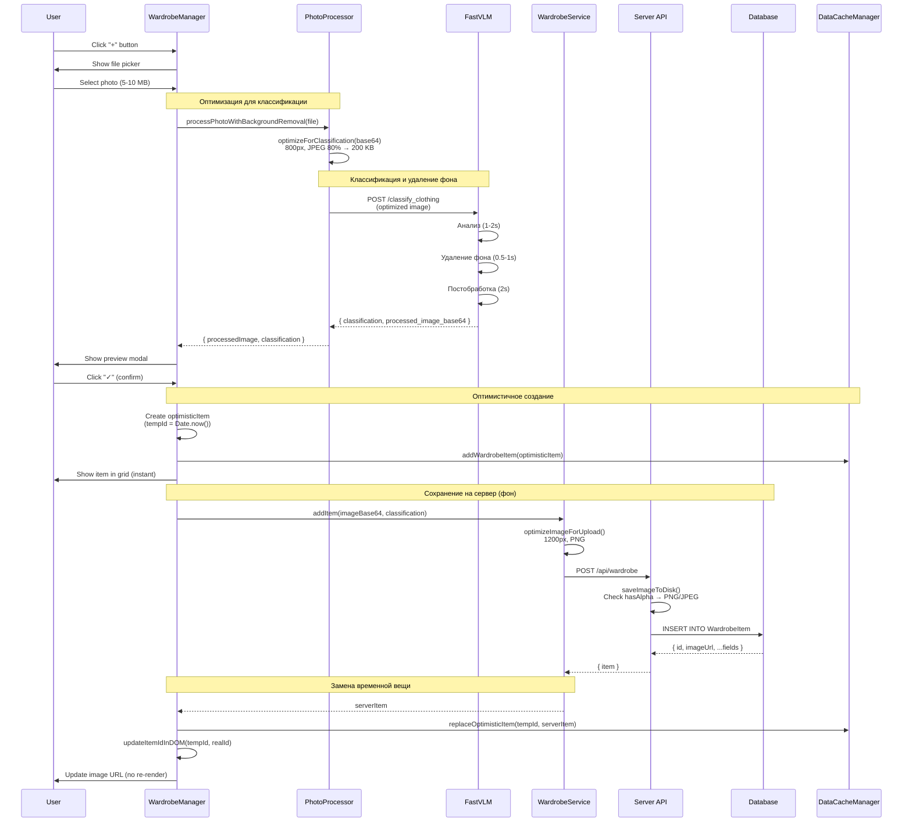

## Редактирование вещи

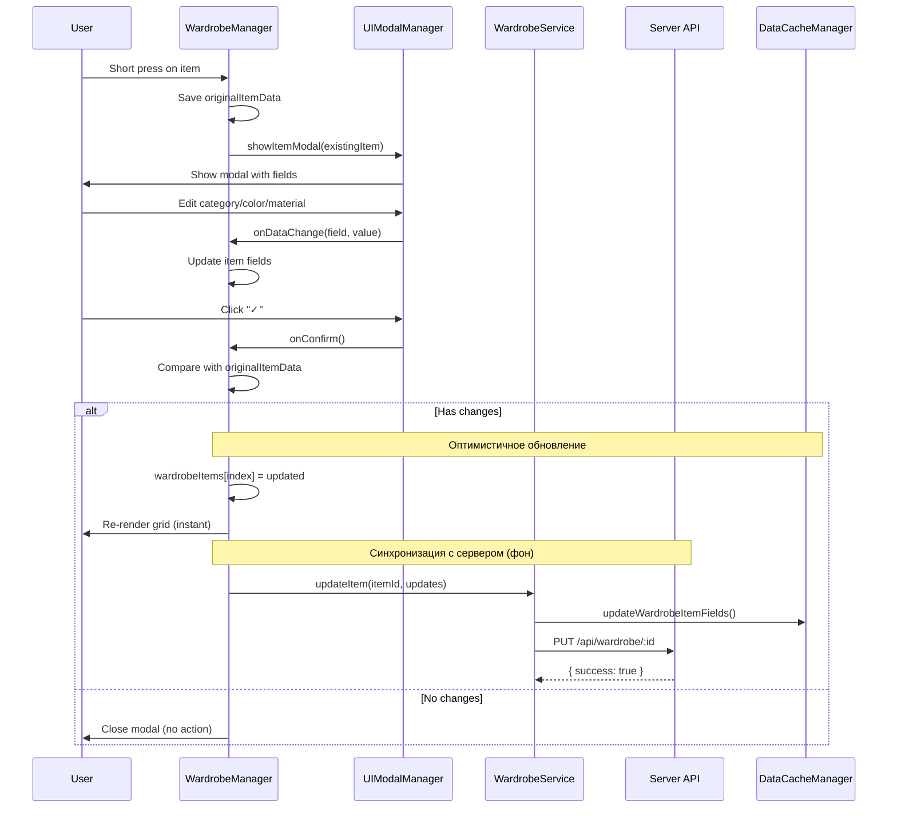

## Удаление вещи

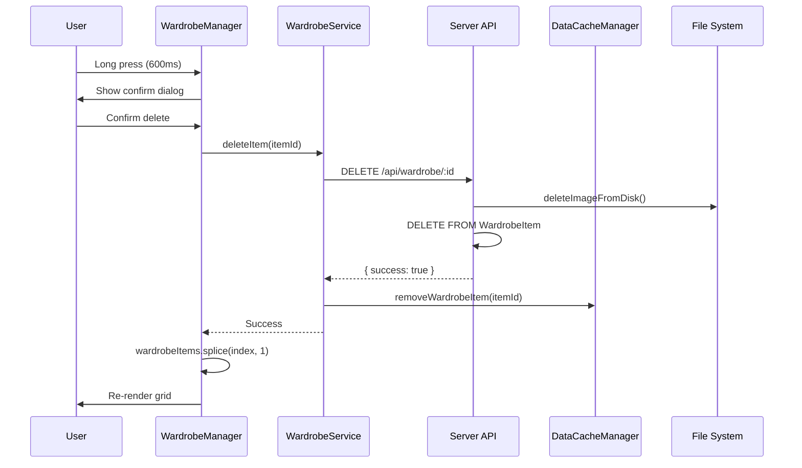

## Загрузка гардероба

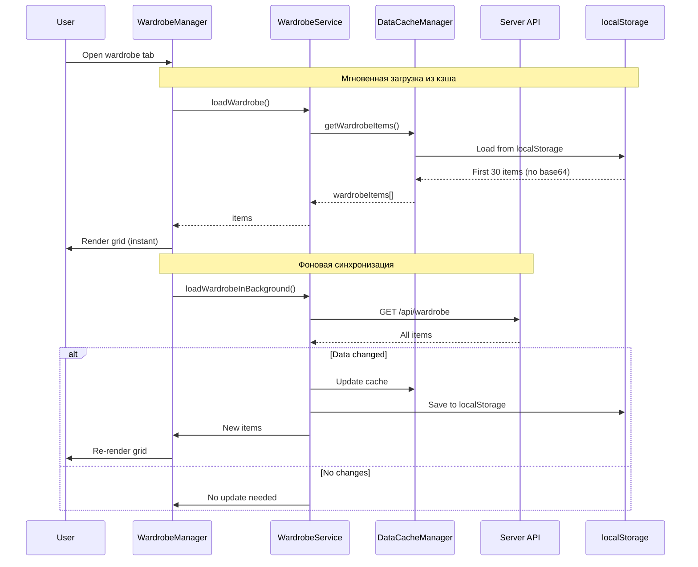

## Кэширование данных

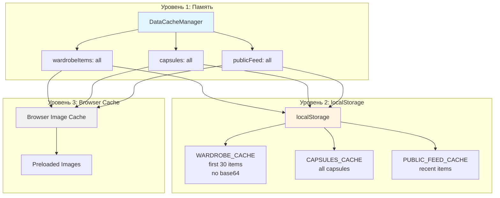

## Оптимизация изображений

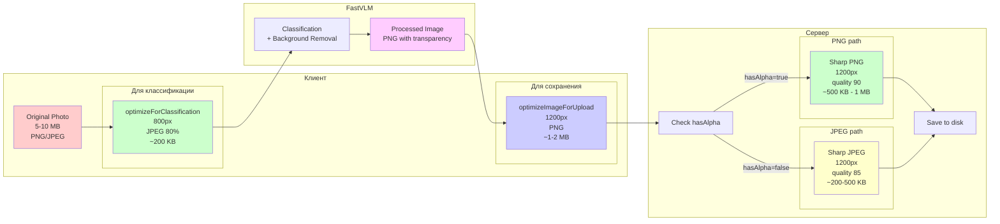

## Архитектура модулей

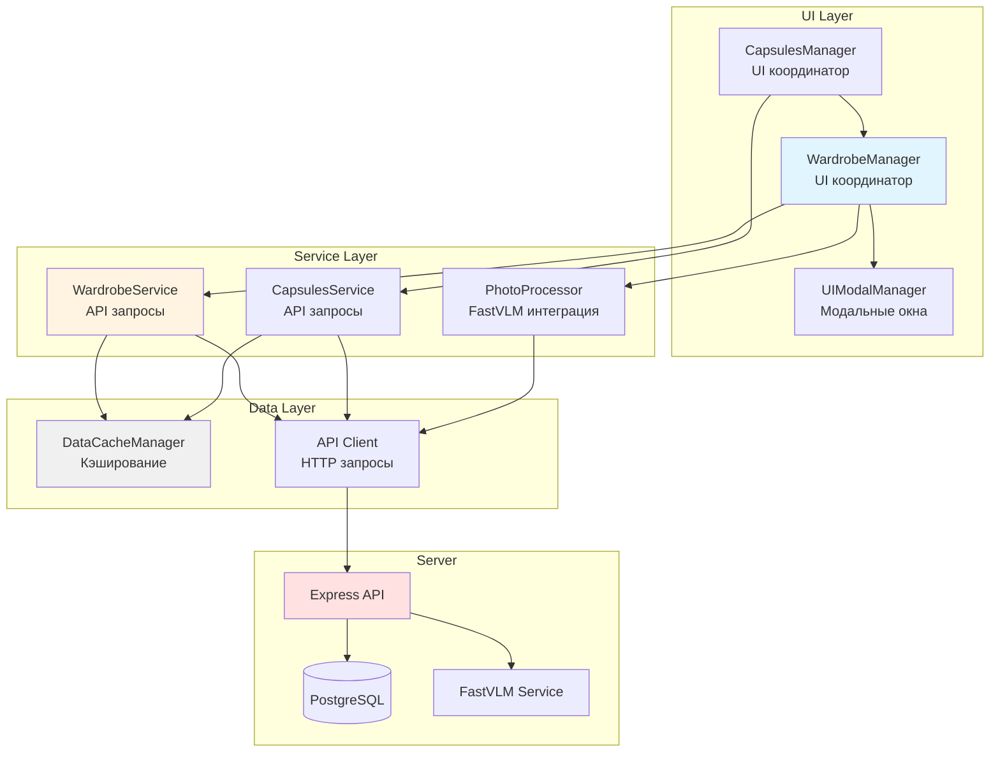

## Событийная система

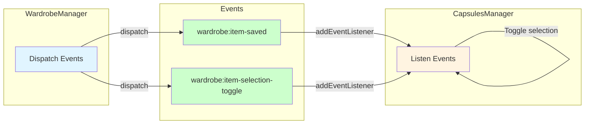

## Два режима гардероба

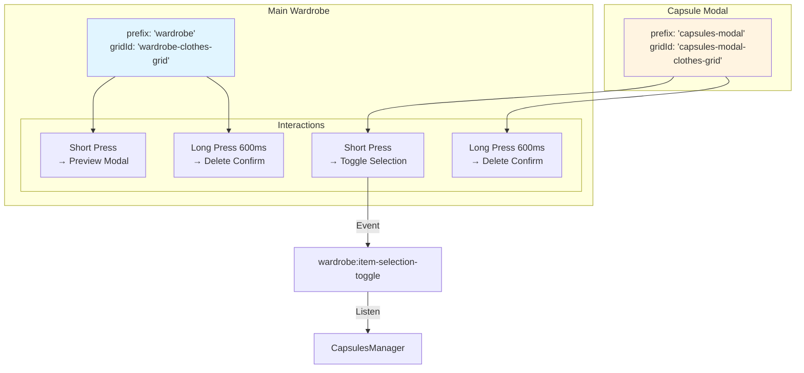

## Оптимистичное обновление

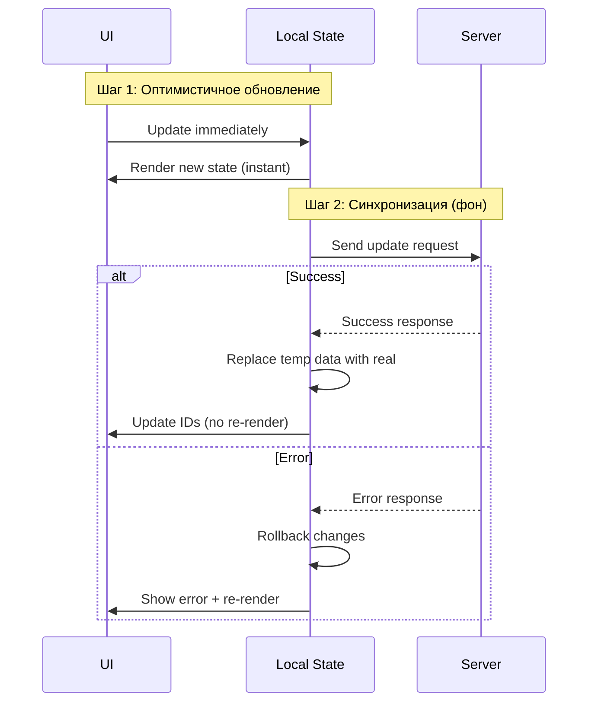

## Производительность

```mermaid
gantt
    title Время добавления вещи (было vs стало)
    dateFormat X
    axisFormat %Ls
    
    section Было (30+ сек)
    Отправка фото на FastVLM : 0, 26000
    Классификация FastVLM : 26000, 32000
    Сохранение на сервер : 32000, 35000
    
    section Стало (3-5 сек)
    Оптимизация на клиенте : 0, 200
    Отправка на FastVLM : 200, 500
    Классификация FastVLM : 500, 2500
    Сохранение на сервер : 2500, 4000
```

## Использование

Эти диаграммы можно:
1. Просматривать в любом Markdown редакторе с поддержкой Mermaid
2. Копировать в документацию
3. Использовать для объяснения архитектуры команде
4. Обновлять при изменении логики

Для рендеринга Mermaid диаграмм:
- GitHub/GitLab - автоматически
- VS Code - установить расширение "Markdown Preview Mermaid Support"
- Online - https://mermaid.live/
