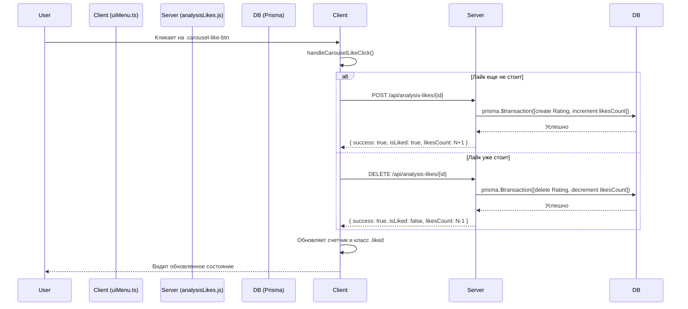

### Анализ работы системы лайков

Система лайков позволяет пользователям выражать свою оценку анализам стиля. Процесс охватывает клиентский интерфейс, серверную логику и базу данных, обеспечивая мгновенное отображение и надежное сохранение состояния.

#### 1. Структура данных (`schema.prisma`)

*   **Модель `Rating`**: В базе данных каждый лайк — это запись в таблице `ratings`.
    *   Она содержит `userId`, `historyItemId` и `ratingType: 'like'`.
    *   Уникальный ключ `@@unique([userId, historyItemId])` гарантирует, что один пользователь может поставить только один лайк одному анализу.
*   **Модель `HistoryItem`**:
    *   Содержит денормализованное поле `likesCount: Int`. Это означает, что мы не считаем лайки каждый раз, а храним готовое значение прямо в записи анализа. Это значительно ускоряет загрузку.

#### 2. Отображение на клиенте (`uiMenu.ts`)

1.  **Первичная отрисовка**:
    *   При создании карточки анализа в карусели (`setupFilledCard`), UI **мгновенно** берет данные из кэшированного объекта `HistoryItem`.
    *   Создается контейнер `div.carousel-likes-container`, внутри которого кнопка `button.carousel-like-btn` (сердечко) и счетчик `span.carousel-likes-count`.
    *   Счетчику сразу присваивается значение из `data.likesCount`.
    *   Если `data.isLiked` равно `true`, кнопке-сердечку добавляется класс `liked`, который закрашивает его.

2.  **Обработка клика**:
    *   На кнопку `carousel-like-btn` вешается обработчик события `click`, который вызывает метод `handleCarouselLikeClick`.
    *   `e.stopPropagation()` используется, чтобы клик по сердечку не вызывал открытие экрана с деталями анализа.

#### 3. Взаимодействие с сервером (`uiMenu.ts` -> `analysisLikes.js`)

1.  **Метод `handleCarouselLikeClick`**:
    *   Определяет текущее состояние: если у кнопки есть класс `liked`, значит, нужно снять лайк, иначе — поставить.
    *   Получает `initData` для аутентификации пользователя.
    *   **Если лайк уже стоит**: Отправляет `DELETE` запрос на эндпоинт `/api/analysis-likes/:historyItemId`.
    *   **Если лайка нет**: Отправляет `POST` запрос на тот же эндпоинт.

#### 4. Логика на сервере (`analysisLikes.js`)

1.  **Аутентификация**: Сервер получает `initData`, валидирует их и извлекает `telegramId` пользователя.
2.  **`POST` запрос (поставить лайк)**:
    *   Сервер проверяет, не существует ли уже лайк от этого пользователя для данного анализа.
    *   Используется **транзакция** `prisma.$transaction([...])` для выполнения двух операций как единого целого (атомарно):
        1.  `prisma.rating.create()`: Создает новую запись в таблице `ratings`.
        2.  `prisma.historyItem.update()`: **Инкрементирует** (`increment: 1`) счетчик `likesCount` в таблице `history_items`.
3.  **`DELETE` запрос (снять лайк)**:
    *   Также используется **транзакция**:
        1.  `prisma.rating.deleteMany()`: Удаляет запись о лайке.
        2.  `prisma.historyItem.update()`: **Декрементирует** (`decrement: 1`) счетчик `likesCount`.

#### 5. Обновление UI (Замыкание цикла)

1.  **Ответ сервера**: После успешной операции сервер всегда возвращает JSON-объект:
    ```json
    {
      "success": true,
      "isLiked": true, // или false
      "likesCount": 16 // новое актуальное значение
    }
    ```
2.  **Обновление на клиенте**:
    *   Метод `handleCarouselLikeClick` получает этот ответ.
    *   Он обновляет текстовое содержимое счетчика: `likesCountEl.textContent = String(response.likesCount)`.
    *   Он добавляет или удаляет класс `liked` у кнопки в зависимости от `response.isLiked`.

Этот подход гарантирует, что UI всегда отображает актуальное состояние, полученное напрямую от сервера после действия пользователя.

#### Схема взаимодействия


