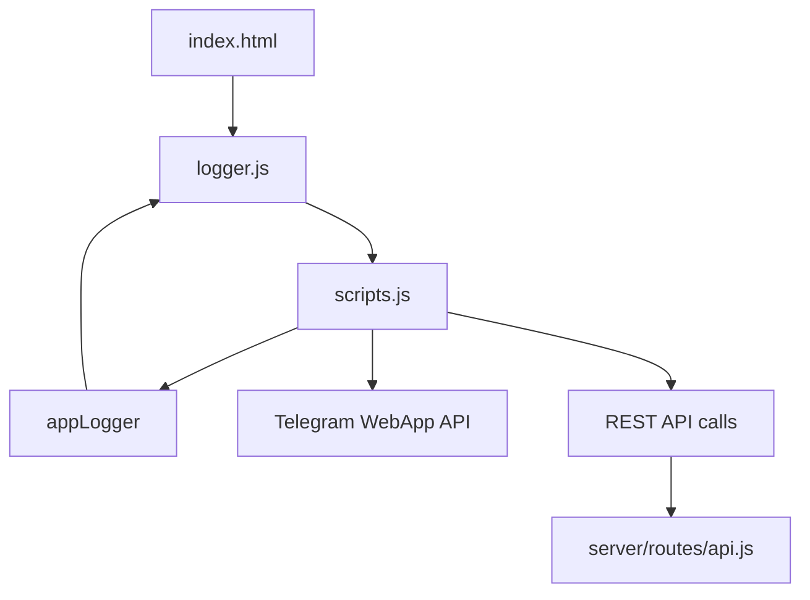
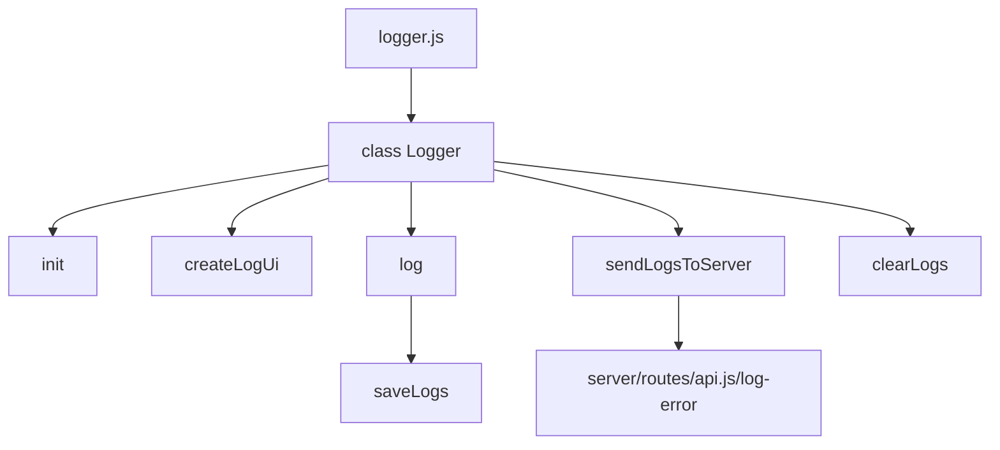

# Структура проекта TgStyle

## Общая архитектура

Проект построен на архитектуре Telegram Mini Apps, где:
- Клиент: HTML/CSS/JS, взаимодействующий с Telegram WebApp JS API
- Сервер: Node.js + Express, взаимодействующий с Telegram Bot API

```
TgStyle/
├── client/           # Клиентская часть (фронтенд)
│   ├── public/       # Публичные файлы
│   │   ├── scripts.js  # Основной скрипт
│   │   ├── logger.js   # Система логирования
│   │   ├── styles.css  # Стили приложения
│   │   │──index.html    # Главная страница
│
├── server/           # Серверная часть (бэкенд)
│   ├── logs/         # Директория для логов
│   │   └── logs.txt  # Файл логов
│   ├── routes/       # Маршруты API
│   │   └── api.js    # Обработчики API-запросов
│   ├── src/          # Исходный код сервера
│   │   ├── api/      # API-модули
│   │   │   ├── auth.js       # Модуль авторизации
│   │   │   └── analyze.js    # Модуль анализа изображений
│   │   └── models/   # Модели данных
│   │       └── User.js       # Модель пользователя
│   └── server.js     # Основной файл сервера
├── docker/           # Настройки для Docker
├── .env              # Конфигурационный файл
└── package.json      # Зависимости проекта
```

## Карта зависимостей

### Клиентская часть



#### Основные вызовы в scripts.js:
- `initApp()` - инициализация приложения
- `loadUserProfile()` - загрузка профиля пользователя из Telegram
- `checkAuth()` - проверка авторизации
- `showFileSelection()` - показ выбора файла/камеры
- `compressImage()` - сжатие изображения
- `saveCurrentAnalysis()` - сохранение анализа
- `loadHistoryFromStorage()` - загрузка истории анализов
- `showSavedAnalysis()` - показ сохраненного анализа

### Система логирования



#### Основные методы Logger:
- `init()` - инициализация логгера
- `createLogUi()` - создание UI для логов
- `log()` - запись лога
- `sendLogsToServer()` - отправка логов на сервер
- `clearLogs()` - очистка логов

### Серверная часть

```mermaid
graph TD
    A[server.js] --> B[routes/api.js]
    B --> C[/log-error]
    B --> D[/convert-model]
    B --> E[/ping]
    C --> F[logs/logs.txt]
```

## Взаимодействие компонентов

1. При инициализации приложения:
   - Загружается `index.html`
   - Подключается `logger.js`, создаётся экземпляр логгера, экспортируемый в window
   - Подключается `scripts.js`, инициализируется основное приложение

2. Пользователь взаимодействует с UI:
   - Выбирает фото для анализа
   - Фото сжимается и отправляется на сервер
   - Результаты анализа отображаются пользователю

3. Логирование:
   - Все действия логируются через `appLogger()`
   - Логи хранятся в localStorage до отправки
   - При нажатии "Отправить" логи отправляются на сервер
   - Сервер сохраняет логи в файл logs.txt

4. История анализов:
   - Результаты анализов сохраняются в localStorage
   - Пользователь может просматривать историю анализов
   - История ограничена 4 последними анализами

## Ключевые технологии и библиотеки

- **Клиент**: 
  - Telegram WebApp JS API
  - Vanilla JavaScript
  - LocalStorage для хранения данных

- **Сервер**:
  - Node.js
  - Express.js
  - File System API для работы с файлами 